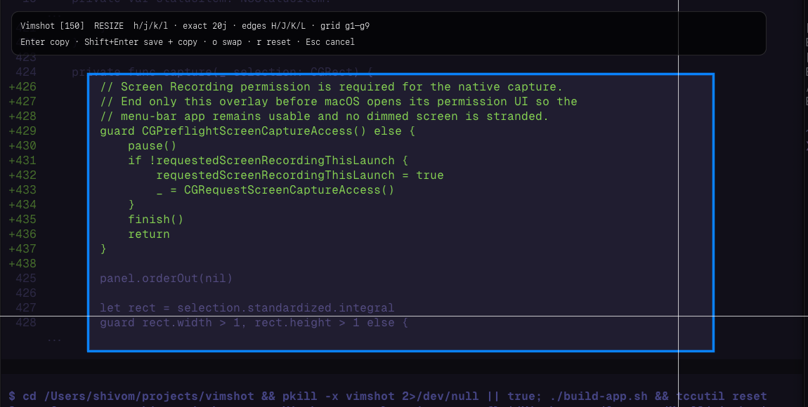
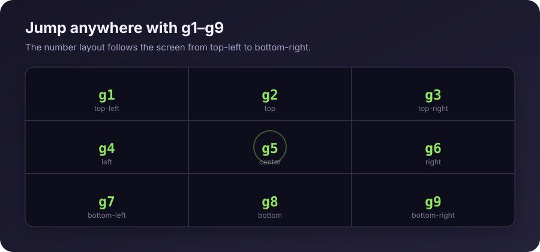

<div align="center">

# Vimshot

**Keyboard-first screenshots for macOS.**

Select regions, jump across the screen, and snap to UI elements without reaching for the mouse.


</div>

Vimshot lives in the menu bar and opens with a global shortcut. It uses Apple's native `screencapture` engine and lets each capture either go only to the clipboard or also be saved in `~/Pictures/Screenshots`.

## Preview

<p align="center">
  
  <br>
  <sub>Vimshot in selection mode: active region, crosshair, count prefix, and keyboard HUD.</sub>
</p>



## Highlights

- **Keyboard-only selection** with familiar `h`, `j`, `k`, and `l` motions
- **Exact movement** such as `20j` or `150l`
- **Fast jumps** to screen edges or a 3×3 grid
- **Window snapping** without extra permissions
- **UI-element snapping** through macOS Accessibility
- **Explicit output modes** for clipboard-only or clipboard-and-file capture
- **Menu-bar launcher** with a configurable global shortcut

## Install

### Requirements

- macOS 13 or newer
- Swift 5.9 or newer (Xcode or the Xcode Command Line Tools)

### Build from source

```sh
git clone https://github.com/ssh-vom/vimshot.git
cd vimshot
make run
```

Vimshot appears as a camera icon in the menu bar. The default shortcut is **⌥⇧S**.

To start it automatically, add `Vimshot.app` under **System Settings → General → Login Items**.

## Usage

1. Press **⌥⇧S** or choose **Take Screenshot** from the menu-bar icon.
2. Move the crosshair to the first corner and press `Enter`.
3. Move to the opposite corner.
4. Press `Enter` to copy only, or `Shift+Enter` to copy and save.

Choose **Set Keyboard Shortcut…** from the menu-bar icon to replace the default shortcut. Triggering the shortcut while a capture is already active resets that capture, and switching away from Vimshot cancels the current overlay cleanly.

## Motions

### Move and jump

| Keys | Action |
|---|---|
| `h` / `j` / `k` / `l` | Move left / down / up / right by 10 pixels |
| Arrow keys | Move in the corresponding direction |
| `20j`, `150l` | Move by the exact pixel count |
| `Ctrl` + motion | Move by 1 pixel |
| `Option` + motion | Move by 100 pixels |
| `H` / `J` / `K` / `L` | Jump to the left / bottom / top / right edge |
| `gh` / `gj` / `gk` / `gl` | Alternate directional edge jumps |
| `g1` … `g9` | Jump to a position on the 3×3 screen grid |
| `gg` / `G` | Jump to the top-left / bottom-right corner |
| `0` / `$` | Jump to the left / right edge |
| `m` | Jump to the center |

### Select and capture

| Keys | Action |
|---|---|
| `Enter` | Set the first corner; at the second corner, copy to clipboard only |
| `Shift+Enter` | At the second corner, copy and save to `~/Pictures/Screenshots` |
| `o` | Swap the fixed and active selection corners |
| `r` | Reset the selection |
| `Esc` / `q` | Cancel the current capture |

### Snap

| Keys | Action |
|---|---|
| `w` | Snap to the window beneath the crosshair |
| `e` | Snap to the Accessibility UI element beneath the crosshair |

After snapping, press `Enter` to copy, or `Shift+Enter` to copy and save.

## Permissions

Vimshot asks only when a feature needs permission:

- **Screen Recording** — required by macOS for the final screenshot
- **Accessibility** — required only for `e` element snapping

Window snapping with `w` does not require Accessibility access. If macOS opens System Settings, the active overlay closes while Vimshot remains available in the menu bar. Approve the permission, then start another capture. macOS may require Vimshot to be reopened once after approval.

## Output

Every successful capture is written to the macOS clipboard as an image. When captured with `Shift+Enter`, it is also saved as:

```text
~/Pictures/Screenshots/Vimshot-YYYY-MM-DD-HHMMSS-SSS.png
```

## Development

The Makefile provides the common workflows:

```sh
make build      # Debug build
make release    # Optimized executable
make app        # Build and sign Vimshot.app
make stop       # Stop any running Vimshot instance
make run        # Build, stop stale copies, and open this bundle
make dev        # Stop stale copies and run with Swift Package Manager
make install    # Replace the copy in ~/Applications
make clean      # Stop Vimshot and remove generated build output
```

Override the installation directory when needed:

```sh
make install INSTALL_DIR=/Applications
```

`build-app.sh` remains available for direct use. It uses an available local code-signing identity when possible, which keeps macOS permission grants stable between rebuilds.

### Seeing an older interface?

macOS identifies all Vimshot builds by the same bundle ID. If another copy is already running from `~/Applications` or a previous checkout, `open` may focus that process instead of launching your new build. Use:

```sh
make run
```

The target now stops every stale Vimshot process and opens the absolute path of the bundle it just built. `make clean` also stops the running app before deleting build output.

## Status

Vimshot is an early preview. The core capture, menu-bar shortcut, motion, snapping, and permission flows work, but the motion model and interface are still being refined.
